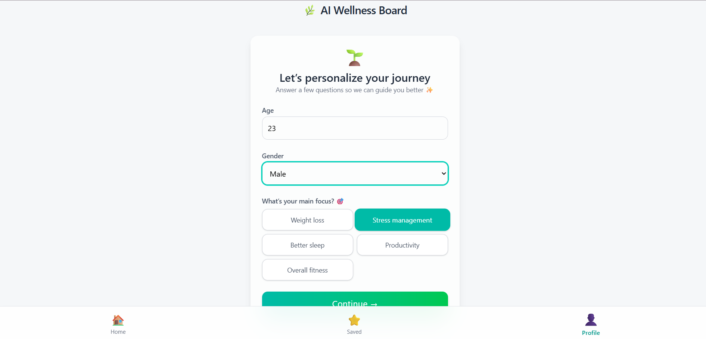
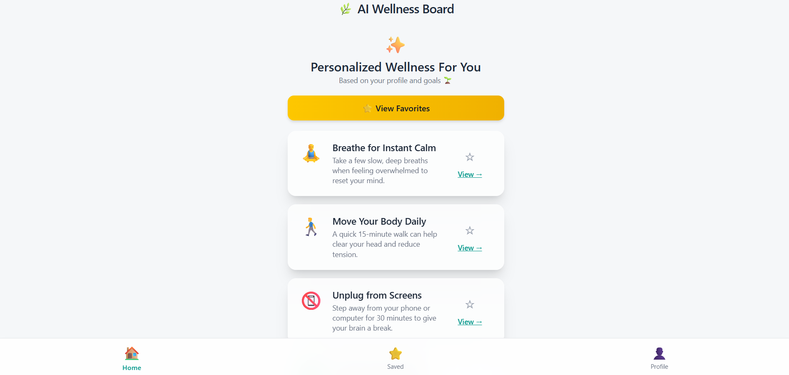
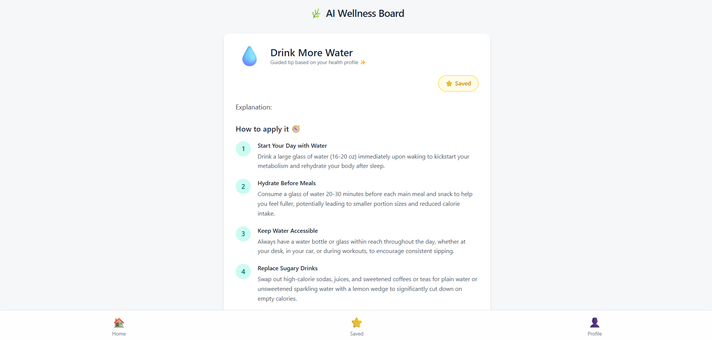
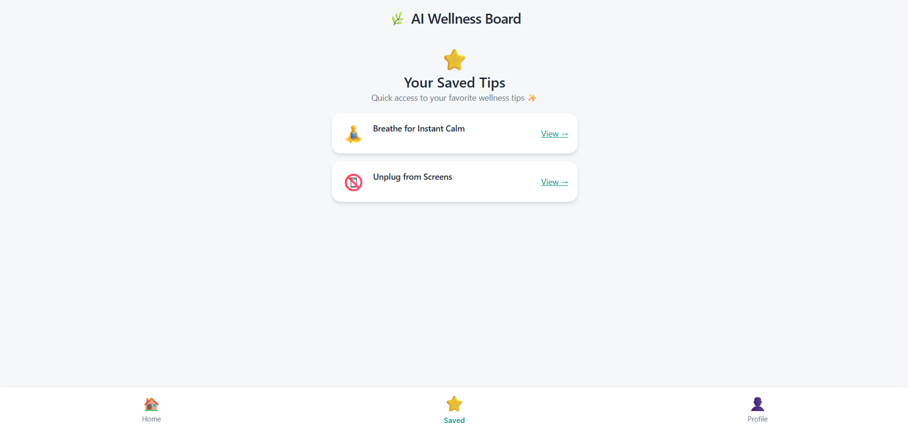
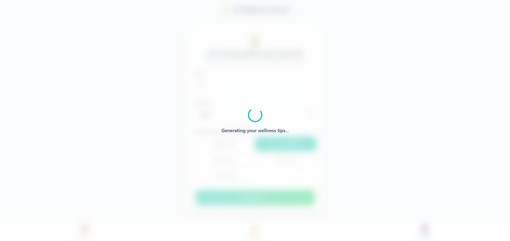

# AI Wellness Recommendation Board

A personalized wellness assistant that generates tailored health tips using AI. Users can enter basic profile information, receive AI-generated recommendations, explore detailed guidance, and save favorites with a polished mobile-first experience.

## 1. Project Setup & Demo

### Prerequisites

- Node.js (v14 or higher)
- npm or yarn
- Gemini API Key from [Google AI Studio](https://makersuite.google.com/app/apikey)

### Installation

1. Clone the repository:
```bash
git clone <repository-url>
cd AI-Generated-Wellness-Recommendation-Board
```

2. Install dependencies:
```bash
npm install
```

3. Create a `.env` file in the root directory:
```bash
touch .env
```

4. Add your Gemini API key to the `.env` file:
```dotenv
VITE_GEMINI_API_KEY=your_gemini_api_key_here
```

**Note:** Replace `your_gemini_api_key_here` with your actual API key from Google AI Studio.

### Run the Application

```bash
npm run dev
```

App runs at:

```
http://localhost:5173
```

### Demo
-  [Mobile screen recording](https://drive.google.com/file/d/1jqwINwnKU5AnUUR5PA0RsiFyOb9YiS2d/view?usp=drive_link)
-  [Live hosted link](https://ai-generated-wellness-recommendation-assignment.vercel.app/)

## 2. Problem Understanding

This project simulates a personalized wellness assistant that tailors habit-based recommendations based on the user's:
- Age
- Gender
- Wellness Goal (Stress, Sleep, Weight Loss, Productivity, Fitness)

The goal is to provide simple, actionable, human-friendly guidance, not medical advice.

### Assumptions
- Users prefer short, digestible habits over long instructions.
- UI should feel calm, clean, and mobile friendly.
- The system provides lifestyle practices — not clinical advice.

## 3. AI Prompts & Iterations

### Initial Prompt Example

```
Generate 5 wellness tips for stress relief. Include:
- 1 emoji
- Short title
- 1 sentence summary
```

### Issues noticed
- Output was inconsistent in format
- Some responses too long or repetitive
- Tips lacked action steps

### Improved Generation Prompt

```
Generate 5 concise wellness tips based on this profile: {age}, {gender}, {goal}.
Rules:
- 1 emoji icon per tip
- Title under 5 words
- Summary under 120 characters
- Must be actionable and beginner friendly
```

### Detailed Tip Prompt

```
Expand this selected tip into:
- A detailed description (max 150 words)
- 4 actionable steps

Format each step as:

**Title:** one sentence instruction.
```

## 4. Architecture & Code Structure

```
src/
 ├─ components/
 │   ├─ Navbar.tsx
 │   └─ LoadingOverlay.tsx
 ├─ screens/
 │   ├─ ProfileScreen.tsx
 │   ├─ TipsBoardScreen.tsx
 │   ├─ TipDetailScreen.tsx
 │   └─ FavoritesScreen.tsx
 ├─ context/
 │   └─ WellnessContext.tsx
 ├─ App.tsx
 └─ index.css
```

### Technology Used

| Feature | Implementation |
|---------|----------------|
| Framework | React |
| State Management | React Context |
| Styling | Tailwind CSS |
| Persistence | LocalStorage |
| AI Requests | Gemini/OpenAI (pluggable) |
| Navigation | State-based routing |

## 5. Screenshots & Documentation

## 5. Screenshots & Documentation

### Profile Setup Screen


### Tips Board Screen


### Tip Detail Screen


### Favorites Screen


### Loading Overlay


## 6. Known Issues & Improvements

| Issue | Planned Improvement |
|-------|---------------------|
| AI may repeat similar tips | Add anti-duplication logic |
| No dark mode | Add theme toggle |
| No onboarding | Add welcome walkthrough |
| Only local storage | Add backend/user accounts |
| No habit tracking | Add streaks/progress |

## 7. Additional Features Implemented

- Smooth page transitions
- Unified loading component
- Clean modern UI with wellness tone
- Fully responsive mobile-first build
- Saved tips persist after refresh

## 8. Future Enhancements

- Habit streak tracking
- Weekly or monthly AI health plan
- Notifications and reminders (PWA)
- Speech-to-text and voice coaching
- Gamified achievements and badges


